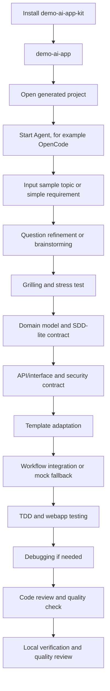

# Skill Pruning Workflow

本文件用于筛选 `demo-ai-app-kit` 项目内技能。判断范围只限本项目，不假设有全局技能兜底；暂不按目录体积筛选；删除前必须确认技能在本项目 workflow 中没有独立职责，或核心能力已经合并进保留技能。

当前状态：

- 第一批已删除：`grill-me`、`decision-mapping`、`ce-test-browser`、`spec-driven-development`。
- 第二批已合并后删除：`test-driven-development`、`diagnosing-bugs`。
- `review`、`ce-code-review`、`ce-debug` 保留，但不进默认链路。

## 筛选目标

`demo-ai-app-kit` 的目标是生成好用、可维护的 AI Web 应用。技能筛选服务于这个产品目标，而不是只服务一次冲刺。

判断标准：

- 是否提升生成应用质量：需求清晰、交互合理、接口稳定、代码可读、测试可跑。
- 是否降低维护成本：边界清楚、契约可追踪、文档足够、错误可定位。
- 是否能放进项目 workflow：从需求到代码、测试、验收有明确位置。
- 是否和其他技能重复抢触发：重复能力可以保留，但必须标注主入口、触发条件和合并方向。

## Product Workflow



Expected generated-app workflow:

1. Local install creates the CLI.
2. `demo-ai-app <project-name>` creates a runnable project.
3. The developer starts an Agent in that project.
4. The Agent asks useful blocking questions and writes requirements plus a technical plan.
5. The Agent freezes a one-page SDD-lite contract before implementation.
6. The Agent implements code according to the plan and template constraints.
7. The Agent runs local tests and browser verification, reporting exact commands, URL, and failures.
8. The Agent runs a lightweight quality review.
9. The Agent runs `bin/check-demo` and verifies the project locally.

## Default Product-Quality Path

默认链路就是产品质量基线。只要对生成好应用必需，就默认走。

```text
需求输入
-> ce-brainstorm 或 question-refiner
-> grilling
-> solution-stress-test
-> domain-modeling
-> tech-plan-generator / SDD-lite
-> api-and-interface-design
-> security-and-hardening
-> template-adapter
-> workflow-integration-planner
-> tdd
-> webapp-testing
-> debugging-and-error-recovery
-> code-review-and-quality
```

Routing rules:

- 简单需求：先走 `question-refiner`，跳过完整 `ce-brainstorm`。
- 模糊、复杂或产品形态不清：走 `ce-brainstorm`。
- 重要方案冻结前：走 `grilling`，但限制问题数量，避免无限访谈。
- 业务术语超过 3 个，或 UI/API/workflow 字段容易漂移：走 `domain-modeling`。
- 有前后端接口、workflow contract、mock fixture：走 `api-and-interface-design`。
- 有用户输入、登录、存储、文件或外部调用：走 `security-and-hardening`。
- 涉及行为逻辑、adapter、mock fixture：走 `tdd`。
- 任何 Web 应用完成后：走 `webapp-testing`。
- 出错时：走 `debugging-and-error-recovery`。
- 交付前：走 `code-review-and-quality`。

## Explicit Heavy Path

以下技能不进默认链路，只在用户或 workflow 明确触发时使用：

- `ce-code-review`: 重要版本、PR 级、最终重型审查。
- `review`: 有明确 spec 和 diff base 时做 standards/spec 双轴审查。
- `ce-debug`: 普通调试失败后升级。
- `ce-dogfood-beta`: 最终端到端 dogfood。
- `mcp-builder`: 生成 MCP 集成时使用。
- `to-prd` / `to-issues` / `triage`: 接入 issue tracker 产品流时使用。
- `handoff`: 多 Agent 或多会话交接时使用。

## Stage Routing

### 1. Requirement Clarification

Default product-quality skills:

- `question-refiner`: main entry for simple topics and rough app ideas.
- `ce-brainstorm`: use for vague, complex, or product-shape-level ideas.
- `grilling`: bounded challenge before freezing important plans.
- `solution-stress-test`: checks whether the requirement has a complete user loop, observable acceptance criteria, and realistic scope.
- `domain-modeling`: use when domain terms or cross-layer fields can drift.

Optional support:

- `ubiquitous-language`: use when terminology must be extra consistent across UI, API, workflow, and docs.
- `to-prd`: explicit issue-tracker/product-management flow only.

Removed:

- `grill-me`: wrapper around `grilling`; no project-specific value.
- `decision-mapping`: multi-session decision map; keep out unless long-running product governance becomes a feature.

### 2. Technical Plan And Contract

Default product-quality skills:

- `tech-plan-generator`: page list, data model, local APIs, workflow contract, SDD-lite contract, verification plan.
- `api-and-interface-design`: API/module/workflow/mock contracts.
- `security-and-hardening`: auth, user input, storage, files, external workflow calls, and boundary validation.

Optional support:

- `codebase-design`: use when a generated app needs reusable modules rather than one-off page scripts.
- `planning-and-task-breakdown`: use for larger generated apps that need ordered implementation slices.
- `documentation-and-adrs`: use when a decision affects future maintainers.
- `doc-coauthoring`: use for generated docs that need reader-oriented structure.

Removed:

- `spec-driven-development`: default flow uses SDD-lite inside `tech-plan-generator`; full SDD mode is not part of the current product contract.

### 3. Implementation

Default product-quality skills:

- `template-adapter`: main implementation entry; adapt the bundled template rather than starting from blank code.
- `workflow-integration-planner`: define Star Agent request/response, timeout, error shape, and mock fallback.

Optional support:

- `incremental-implementation`: use when implementation touches multiple files.
- `implement`: useful only if a generated project later works from PRD/issues.
- `context-engineering`: useful for improving generated project Agent context.
- `ce-work`: keep only if compound-engineering execution becomes a first-class workflow.

### 4. Testing, Debugging, And Review

Default product-quality skills:

- `tdd`: main behavior-test skill for local API, workflow adapter, field mapping, mock fixture logic, and regression fixes.
- `webapp-testing`: main browser verification route using Playwright.
- `debugging-and-error-recovery`: main failure recovery skill when builds, tests, workflow integration, or runtime behavior fail.
- `code-review-and-quality`: main lightweight quality review before report generation, handoff, or submission.

Explicit heavy or optional skills:

- `browser-testing-with-devtools`: optional high-fidelity browser diagnosis when DevTools MCP is configured.
- `review`: explicit standards/spec review with a known spec and diff base.
- `ce-code-review`: heavy PR/final review mode.
- `ce-debug`: escalation after normal debugging fails.
- `performance-optimization`: use when performance is an explicit product requirement or measured problem.

Removed or merged:

- `test-driven-development`: merged into `tdd` with Prove-It, test size, state assertions, DAMP, and mock guidance.
- `diagnosing-bugs`: merged into `debugging-and-error-recovery` with tight feedback loop and falsifiable hypothesis workflow.
- `ce-test-browser`: duplicate browser route; `webapp-testing` remains the browser test default.

### 5. Reporting / Diagram / Theme Package (Moved Out)

The following capabilities no longer ship with `demo-ai-app-kit`. They can be maintained in a separate reporting/PPT extension if needed, but they are not part of the default generated-app contract:

- `demo-script-generator`: demo scripts, judge Q&A, and product story.
- `architecture-diagram`: architecture visuals.
- `baoyu-diagram`: broader diagram and visualization generation.
- `guizang-ppt-skill`: web PPT / presentation output.
- `theme-factory`: visual polish for docs, slides, and HTML artifacts.

Reasoning: the kit's scope is "generate a runnable, maintainable, verifiable AI Web app". Report materials, slides, diagrams, and visual themes are valuable for competition demos, but they are separate deliverables with their own tooling and review cycle. Removing them from the default path keeps the kit focused, reduces copy-on-write size, and avoids bundling unused skills into every generated project.

### 6. Long-Term Product Quality

Keep as explicit-mode skills:

- `ce-agent-native-architecture`: useful if generated apps include agent-native loops or MCP tools.
- `ce-agent-native-audit`: useful for auditing agent-native product structure.
- `ce-compound`: useful for preserving lessons after repeated generated-app runs.
- `ce-doc-review`: useful for reviewing requirements/plans/docs.
- `ce-dogfood-beta`: high-cost end-to-end dogfood mode.
- `mcp-builder`: generated MCP integrations.
- `handoff`: multi-agent or multi-session transfer.
- `to-issues`: issue tracker workflow.
- `triage`: issue/PR triage workflow.

## Current Keep Set

Default product-quality path:

- `question-refiner`
- `ce-brainstorm`
- `grilling`
- `solution-stress-test`
- `domain-modeling`
- `tech-plan-generator`
- `api-and-interface-design`
- `security-and-hardening`
- `template-adapter`
- `workflow-integration-planner`
- `tdd`
- `webapp-testing`
- `debugging-and-error-recovery`
- `code-review-and-quality`

Explicit heavy path:

- `ce-code-review`
- `review`
- `ce-debug`
- `ce-dogfood-beta`
- `mcp-builder`
- `to-prd`
- `to-issues`
- `triage`
- `handoff`

Optional support / experimental:

- `browser-testing-with-devtools`
- `ubiquitous-language`
- `codebase-design`
- `planning-and-task-breakdown`
- `documentation-and-adrs`
- `doc-coauthoring`
- `incremental-implementation`
- `implement`
- `context-engineering`
- `ce-work`
- `ce-agent-native-architecture`
- `ce-agent-native-audit`
- `ce-compound`
- `ce-doc-review`
- `performance-optimization`

Deleted:

- `grill-me`: wrapper only.
- `decision-mapping`: too heavy unless long-running planning becomes a product feature.
- `ce-test-browser`: duplicate browser route; `webapp-testing` remains the browser test default.
- `spec-driven-development`: duplicate with SDD-lite default; full spec mode is deferred.
- `test-driven-development`: merged into `tdd`.
- `diagnosing-bugs`: merged into `debugging-and-error-recovery`.

Next merge/routing candidates:

- `review` / `ce-code-review` / `code-review-and-quality`: keep lightweight default plus explicit heavy review mode; do not delete yet.
- `browser-testing-with-devtools` / `webapp-testing`: keep separate while browser tool availability differs.
- `ubiquitous-language` / `domain-modeling`: consider whether terminology work should remain separate after real generated-app runs.

## Workflow Fit Assessment

Target flow:

```text
Install -> demo-ai-app <project-name> -> start Agent -> input topic
-> questions -> requirements + tech plan -> code -> integration testing -> quality review
```

Assessment:

- Fit at prompt/workflow level: mostly yes. `AGENTS.md`, `prompts/opencode-entry.md`, and core skills describe the product-quality chain.
- Fit at install/CLI level: yes. `package.json` and `bin/demo-ai-app <project-name>` are now in place; the generator copies the template, `AGENTS.md`, entry prompt, core skills, `bin/check-demo`, and a README skeleton into the generated project.
- Fit at artifact level: yes. Fixed output paths are now specified: `docs/requirements/requirements.md`, `docs/technical/tech-plan.md`, `docs/technical/workflow-integration.md`, and `docs/execution/test-report.md`. The generator copies skeletons for each path into the generated project.
- Fit at testing level: mostly yes. `bin/check-demo` verifies the generated project has README, run command, URL, mock fallback, workflow notes, and the standard docs, and detects unfilled placeholders in those docs. Content-quality checks for tests can be added later.
- Fit at quality-review level: yes. `code-review-and-quality` is the final default gate before handoff; it checks coherence, local run, tests, README accuracy, and known limits.

Verdict: the workflow is now a generated-project contract with fixed paths and a check script. The next task is to run a full sample topic through the chain and refine content-quality checks.
