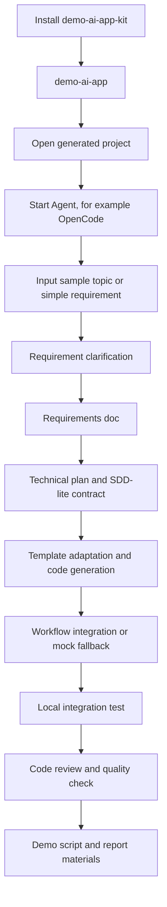

# Skill Pruning Workflow

本文件用于筛选 `demo-ai-app-kit` 项目内技能。判断范围只限本项目，不假设有全局技能兜底；暂不按目录体积筛选；删除前必须先确认技能在本项目 workflow 中没有独立职责。

当前状态：第一批已删除 `grill-me`、`decision-mapping`、`ce-test-browser`、`spec-driven-development`。

## 筛选目标

`demo-ai-app-kit` 的目标是生成好用、可维护的 AI Web 应用。技能筛选服务于这个产品目标，而不是只服务一次比赛冲刺。

判断标准：

- 是否提升生成应用质量：需求清晰、交互合理、接口稳定、代码可读、测试可跑。
- 是否降低维护成本：边界清楚、契约可追踪、文档足够、错误可定位。
- 是否能放进项目 workflow：从需求到代码、测试、汇报材料有明确位置。
- 是否和其他技能重复抢触发：重复能力可以先保留，但必须标注主入口和合并方向。

## Product Workflow



The expected generated-app workflow is:

1. Local install creates the CLI.
2. `demo-ai-app <project-name>` creates a runnable project.
3. The developer starts an Agent in that project.
4. The Agent asks only useful blocking questions and writes requirements plus a technical plan.
5. The Agent implements code according to the plan.
6. The Agent runs local integration tests and reports exact commands, URL, and failures.
7. The Agent generates report/demo materials from the verified app, not from imagined behavior.

## Stage Routing

### 1. Requirement Clarification

Default skills:

- `question-refiner`: main entry for simple topics and rough app ideas.
- `solution-stress-test`: checks whether the requirement has a complete user loop, observable acceptance criteria, and realistic scope.

Product-enhancement skills:

- `ce-brainstorm`: use for vague, complex, or product-shape-level ideas.
- `grilling`: use before freezing important plans.
- `domain-modeling`: use when the app has non-trivial domain concepts.
- `ubiquitous-language`: use when terminology must be consistent across UI, API, workflow, and docs.
- `to-prd`: use only when a durable PRD is useful; do not put it in the default short path.

Removed in first pass:

- `grill-me`: wrapper around `grilling`; no project-specific value.
- `decision-mapping`: multi-session decision map; too heavy for the current generated-app workflow.

### 2. Technical Plan And Contract

Default skills:

- `tech-plan-generator`: page list, data model, local APIs, workflow contract, SDD-lite contract, verification plan.
- `api-and-interface-design`: use when API/module contracts are non-trivial.
- `security-and-hardening`: use when generated apps handle auth, user input, storage, files, or external workflow calls.

Product-enhancement skills:

- `codebase-design`: use when a generated app needs reusable modules rather than one-off page scripts.
- `planning-and-task-breakdown`: use for larger generated apps that need ordered implementation slices.
- `documentation-and-adrs`: use when a decision affects future maintainers.
- `doc-coauthoring`: use for generated docs that need reader-oriented structure.

Removed in first pass:

- `spec-driven-development`: default flow uses SDD-lite inside `tech-plan-generator`; full SDD mode is not part of the current product contract.

### 3. Implementation

Default skills:

- `template-adapter`: main implementation entry; adapt the bundled template rather than starting from blank code.
- `workflow-integration-planner`: define Star Agent request/response, timeout, error shape, and mock fallback.
- `incremental-implementation`: use when implementation touches multiple files.

Product-enhancement skills:

- `implement`: useful if a generated project later works from PRD/issues.
- `context-engineering`: useful for improving generated project Agent context.
- `ce-work`: keep only if the project adopts compound-engineering execution as a first-class workflow.

### 4. Testing, Debugging, And Review

Default skills:

- `webapp-testing`: main browser verification route using Playwright.
- `tdd`: main behavior-test skill for local API, workflow adapter, field mapping, and mock fixture logic.
- `debugging-and-error-recovery`: main failure recovery skill when builds, tests, or runtime behavior fail.
- `code-review-and-quality`: main final quality review before submission or handoff.

Product-enhancement skills:

- `test-driven-development`: valuable test guidance, but overlaps with `tdd`; merge the best parts into a project-specific testing skill before deleting.
- `browser-testing-with-devtools`: valuable for live browser diagnosis when Chrome DevTools MCP is configured; keep as optional high-fidelity mode.
- `review`: useful for spec-vs-standards review after requirements and technical plan exist.
- `ce-code-review`: heavy review mode; use for important generated apps, not the default path.
- `diagnosing-bugs`: overlaps with `debugging-and-error-recovery`; keep until merged or routed.
- `ce-debug`: overlaps with debugging skills; keep only if compound-engineering debug workflow is adopted.
- `performance-optimization`: use when app performance is an explicit product requirement or a measured problem.

Removed in first pass:

- `ce-test-browser`: overlaps with `webapp-testing` and strongly routes to `agent-browser`; the project keeps Playwright as the default browser verification path.

### 5. Demo, Diagram, And Report Materials

Default skills:

- `demo-script-generator`: generates 10-minute demo script, judge Q&A, and product story from verified app behavior.

Product-enhancement skills:

- `architecture-diagram`: architecture visuals.
- `baoyu-diagram`: broader diagram and visualization generation.
- `guizang-ppt-skill`: web PPT / presentation output; keep, but remove nested `.git`.
- `theme-factory`: visual polish for docs, slides, and HTML artifacts.

### 6. Long-Term Product Quality

Keep as explicit-mode skills:

- `ce-agent-native-architecture`: useful if generated apps include agent-native loops or MCP tools.
- `ce-agent-native-audit`: useful for auditing agent-native product structure.
- `ce-compound`: useful for preserving lessons after repeated generated-app runs.
- `ce-doc-review`: useful for reviewing requirements/plans/docs.
- `ce-dogfood-beta`: high-cost end-to-end dogfood mode; keep only as explicit final pass.
- `mcp-builder`: keep if the kit may generate MCP integrations.
- `handoff`: keep if multiple agents or sessions are a supported workflow.
- `to-issues`: keep only if issue tracker workflow becomes part of the product.
- `triage`: keep only if issue/PR triage becomes part of the product.

## Current Keep Set

Default path:

- `question-refiner`
- `solution-stress-test`
- `tech-plan-generator`
- `template-adapter`
- `workflow-integration-planner`
- `demo-script-generator`
- `webapp-testing`
- `tdd`
- `debugging-and-error-recovery`
- `code-review-and-quality`

Product enhancement:

- `ce-brainstorm`
- `grilling`
- `domain-modeling`
- `ubiquitous-language`
- `to-prd`
- `api-and-interface-design`
- `security-and-hardening`
- `codebase-design`
- `planning-and-task-breakdown`
- `documentation-and-adrs`
- `doc-coauthoring`
- `incremental-implementation`
- `test-driven-development`
- `browser-testing-with-devtools`
- `review`
- `ce-code-review`
- `diagnosing-bugs`
- `performance-optimization`
- `architecture-diagram`
- `baoyu-diagram`
- `guizang-ppt-skill`
- `theme-factory`

Explicit or experimental:

- `ce-agent-native-architecture`
- `ce-agent-native-audit`
- `ce-compound`
- `ce-debug`
- `ce-doc-review`
- `ce-dogfood-beta`
- `ce-work`
- `context-engineering`
- `handoff`
- `implement`
- `mcp-builder`
- `to-issues`
- `triage`

Deleted in first pass:

- `grill-me`: wrapper only.
- `decision-mapping`: too heavy unless long-running planning becomes a product feature.
- `ce-test-browser`: duplicate browser route; `webapp-testing` remains the browser test default.
- `spec-driven-development`: duplicate with SDD-lite default; full spec mode is deferred.

Next merge candidates:

- `tdd` / `test-driven-development`: merge into one project-specific testing skill.
- `debugging-and-error-recovery` / `diagnosing-bugs` / `ce-debug`: merge or route by severity.
- `review` / `ce-code-review` / `code-review-and-quality`: keep lightweight default plus explicit heavy review mode.

## Workflow Fit Assessment

Target flow:

```text
Install -> demo-ai-app <project-name> -> start Agent -> input topic
-> questions -> requirements + tech plan -> code -> integration testing -> report materials
```

Assessment:

- Fit at prompt/workflow level: mostly yes. `AGENTS.md`, `prompts/opencode-entry.md`, and the six core skills already describe the chain.
- Fit at install/CLI level: not yet. There is no `package.json` and no `demo-ai-app <project-name>` generator.
- Fit at artifact level: partial. The flow asks for requirements and technical plan, but fixed output paths such as `docs/requirements.md` and `docs/tech-plan.md` still need to be specified.
- Fit at testing level: partial. `bin/check-demo` and `webapp-testing` exist, but generated projects need a copied or generated test/check contract.
- Fit at reporting level: partial. `demo-script-generator` exists, but `docs/demo-script.md` and generated-app report output conventions are still missing.

Verdict: the workflow is reasonable and should be the product backbone. The next product task is to turn it from prompt-level guidance into a generated-project contract.
